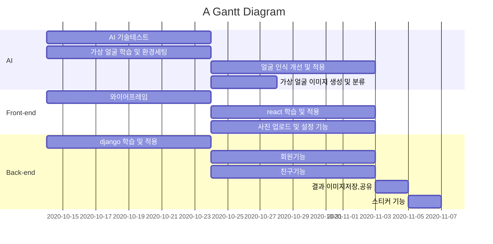

## ☕ 이세계 스타벅스
- '이세계 스타벅스' 누구나 쉽게 사용할 수 있는 **직관성(Intuitiveness)** 을 갖춘 키오스크입니다.

- 주요 기능
    - USER
        - 주문 및 결제
        - 포인트 적립 및 사용
    - MANAGER
        - 로그인 및 로그아웃
        - 메뉴관리
        - 매출관리
        - 주문관리
        - 회원관리

<br/>
<br/>

## 🐣 팀원 소개

<div align="center">


<br/>
<br/>

<table border="0.2">
    <thead>
        <tr>
            <th style="text-align: center;">
            <a href="https://github.com/qorditl1248">@qorditl1248</a><br>
            신선애
            </th>
            <th style="text-align: center;">
            <a href="https://github.com/choiiw">@choiiw</a><br>
            최성원
            </th>
            <th style="text-align: center;">
            <a href="https://github.com/gyeolhwi">@gyeolhwi</a><br>
            김결휘
            </th>
            <th style="text-align: center;">
            <a href="https://github.com/choiddanbi">@choiddanbi</a><br>
            최단비
            </th>
        </tr>
    </thead>
    <tbody>
            <tr>
            <td style="text-align: center;">
            <a href="https://github.com/dongyoon7212">
                
            </a>
        </td>
            <td style="text-align: center;">
            <a href="https://github.com/ez0603">
                
            </a>
        </td>
            <td style="text-align: center;">
            <a href="https://github.com/gyeolhwi">
                
            </a>
        </td>
            <td style="text-align: center;">
            <a href="https://github.com/choiddanbi">
                
            </a>
        </td>
        </tr>
    </tbody>
</table>
</div>

<br/>
<br/>

## ✏️ 역할 분담

### 👩‍💻 신선애
> UX / UI

> 요구사항작성

> 사용자 프론트 / 퍼블리싱

### 👩‍💻 최성원
> API명세서 작성

> 코드 컨벤션

> 관리자 로그인 퍼블리싱

> 관리자 프론트 / 퍼블리싱

### 👩‍💻 김결휘
> 노션 관리

> ERD 설계

> PPT 작성

> 관리자 로그인

> 관리자 백엔드

### 👩‍💻 최단비
> 깃허브 리드미

> ERD 설계

> 사용자 백엔드

<br/>
<br/>

## 🛠️ 기술 스택
<div>


<br>


<br>

<br>

<br>


<br>


</div>

<br/>
<br/>

## 📆 프로젝트 일정
#### 2024. 10. 01 ~ 2024. 11. 13

## 📖 Gantt :fire:


          
<br/>
<br/>

## 🔧 오류 수정

<br/>
<br/>

## 💻 컨벤션
#### 👀 커밋컨벤션
```

1. 커밋 유형 지정
    - 커밋 유형은 영어 대문자로 작성하기
    - 커밋 유형
    - Feat : 새로운 기능 추가
    - Fix : 버그 수정
    - Docs : 문서 수정
    - Style : 코드 formatting, 세미콜론 누락, 코드 자체의 변경이 없는 경우
    - Refactor : 코드 리팩토링
    - Test : 테스트 코드, 리팩토링 테스트 코드 추가
    - Chore : 패키지 매니저 수정, 그 외 기타 수정 ex) .gitignore
    - Design : CSS 등 사용자 UI 디자인 변경
    - Comment : 필요한 주석 추가 및 변경
    - Rename : 파일 또는 폴더 명을 수정하거나 옮기는 작업만인 경우
    - Remove : 파일을 삭제하는 작업만 수행한 경우
    - !BREAKING CHANGE : 커다란 API 변경의 경우
    - !HOTFIX : 급하게 치명적인 버그를 고쳐야 하는 경우

🧾 2. 제목과 본문을 빈행으로 분리 - 커밋 유형 이후 제목과 본문은 한글로 작성하여 내용이 잘 전달될 수 있도록 할 것 - 본문에는 변경한 내용과 이유 설명 (어떻게보다는 무엇 & 왜를 설명)

#️⃣ 3. 제목 첫 글자는 대문자로, 끝에는 . 금지

↩️ 4. 제목은 영문 기준 50자 이내로 할 것

⏺️ 5. 자신의 코드가 직관적으로 바로 파악할 수 있다고 생각하지 말자

👆 6. 여러가지 항목이 있다면 글머리 기호를 통해 가독성 높이기

```

#### 👀 코드컨벤션
```
🛼 문자열을 처리할 때는 쌍따옴표를 사용하도록 합니다.

🐫 문장이 종료될 때는 세미콜론을 붙여줍니다.

💄 함수명, 변수명은 카멜케이스로 작성합니다.

🐫 가독성을 위해 한 줄에 하나의 문장만 작성합니다.

❓ 주석은 설명하려는 구문에 맞춰 들여쓰기 합니다.

🔠 연산자 사이에는 공백을 추가하여 가독성을 높입니다.

🔢 콤마 다음에 값이 올 경우 공백을 추가하여 가독성을 높입니다.

💬 생성자 함수명의 맨 앞글자는 대문자로 합니다.

🔚 var는 절대 사용하지 않는다. (const를 let 보다 위에 선언한다)

👆 const와 let은 사용 시점에 선언 및 할당을 한다. (함수는 변수 선언문 다음에 오도록한다.)

✏️ 외부 모듈과 내부 모듈을 구분하여 사용한다.

🧮 배열과 객체는 반드시 리터럴로 선언한다. (new 사용 X)

📠 배열 복사 시 반복문을 사용하지 않는다.

😎 배열의 시작 괄호 안에 요소가 줄 바꿈으로 시작되었다면 끝 괄호 이전에도 일관된 줄 바꿈 해야한다. (일관되게 모두 줄 바꿈을 해주어야 한다.)

🧶 객체의 프로퍼티가 1개인 경우에만 한 줄 정의를 허용하며, 2개 이상일 경우에는 개행을 강제한다. (객체 리터럴 정의 시 콜론 앞은 공백을 허용하지 않음 콜론 뒤는 항상 공백을 강제)

🧂 메서드 문법 사용 시 메서드 사이에 개행을 추가한다.

🌭 화살표 함수의 파라미터가 하나이면 괄호를 생략한다.

🍳 변수 등을 조합해서 문자열을 생성하는 경우 템플릿 문자열을 이용한다.

🧇 변수 등을 조합해서 문자열을 생성하는 경우 템플릿 문자열을 이용한다.

🥞 wildcard import는 사용하지 않는다. (import문으로부터 직접 export하지 않는다.)

🥖 한 줄짜리 블록일 경우라도 {}를 생략하지 않으며 명확히 줄 바꿈 하여 사용한다.

🥯 switch-case 사용 시 첫 번째 case문을 제외하고 case문 사용 이전에 개행한다.

🥐 삼중 등호 연산자인 ===, !==만 사용한다.

🚐 반복문 사용은 일반화된 순회 메서드 사용을 권장한다.

🚑 람다함수 안에서 밖에 있는 변수를 사용하지 말라

🚚 코드 블럭 주석 처리를 위해서는 한 줄 주석을 사용한다. 여러 줄 주석을 작성할 때는 *의 들여쓰기를 맞춘다. 주석의 첫 줄과 마지막 줄은 비워둠

💫 시작 괄호 바로 다음과 끝 괄호 바로 이전에 공백이 있으면 안 된다.
```

## 📊 API 명세서

<br/>
<br/>

## 🔗 ERD 설계도

<br/>
<br/>

## 📋 메뉴 구조도

<br/>
<br/>

## ✨ 화면 구현
